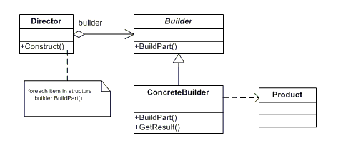

#Builder Pattern
##Scenario:
    When there are multiple complex obects with common steps of construction we can choose this pattern.
In other words when construction process for different object is same we can abstract this process thus make it simple to add another such complex object to the code without duplicating the construction logic.
##UML Diagram:

[pic source](https://www.patrickschadler.com/builder-design-pattern/)

##Element Description:

###Director:
    Director knows the receipe or process or the order of calling methods to create an object that implements Builder interface.
###Builder:
    Contains the collection of methods that all the problem elements (or multiple complex objects that are having common receipe for creation) needs to create the object.
###Concrete Builders:
    These are problem elements and have individual implementation for builder interface methods.
    
###Conclusion:
    Use this pattern only when it is conclusively known that all the products will have only the common set of construction methods that are encapsulated in Builder interface.
    Else it will turn very bad if one have to add new product to this construction technique that needs extra method to be added to Builder interface.
    Also it is a noteworthy to understand that Director can be made singleton and could help in some cases.